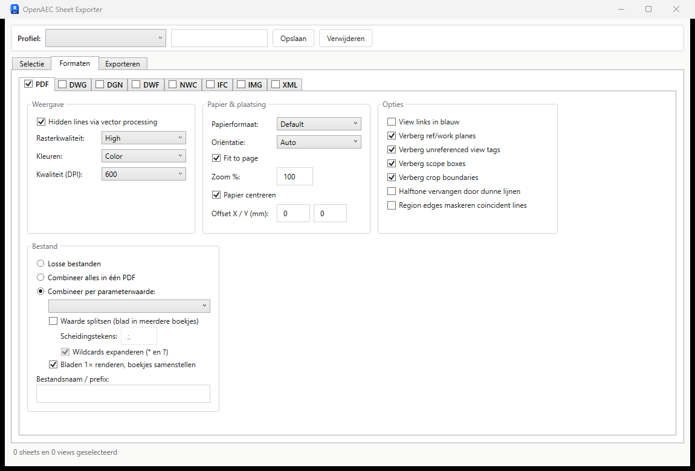

# OpenAEC Sheet Exporter

Batch-export van Revit sheets en views naar **PDF, DWG, DGN, DWF, NWC, IFC, afbeeldingen en XML** — vanuit één venster, met parametrische bestandsnamen en deelbare exportprofielen.

Open vervanger voor DiRoots ProSheets, zonder exportlimiet of premium-licentie. Onderdeel van de OpenAEC-toolset (ribbon tab "OpenAEC", naast de BCF Manager).

📦 **[Download de installer](https://github.com/jochem25/openaec-sheets-revit/releases/latest)** — per-user, geen adminrechten nodig (Revit 2025/2026).



## Features

- **Selectie:** sheets/views met zoekfilter en View/Sheet Set-filter, eigen bestandsnaam per rij
- **PDF:** native vector-PDF (Revit 2022+ API, geen printerdriver), los of gecombineerd
- **PDF-boekjes:** combineer per parameterwaarde; waarde splitsen op `;`/`,` zodat één blad in meerdere boekjes komt; glob-wildcards (`*` = voorblad in elk boekje, `Z_*` = alle woningboekjes)
- **Snel:** bladen worden 1× gerenderd en boekjes samengesteld (met bookmark per blad); batch-render in één Revit-call; exporttimer in de statusregel
- **DWG/DGN:** gebruikt de export setups uit het model
- **IFC:** versie, property sets, space boundaries, alle gangbare opties
- **Naamgeving:** vaste tekst + parameter-tokens — `TO_{Sheet Number}_{Sheet Name}` — met token-kiezer en live voorbeeld; document-tokens (`{Project Number}`, `{Sheet Set}`, …), titleblock- en viewparameters, `{Group}` in boekjesnamen
- **Profielen:** alle instellingen als JSON opslaan/laden
- **Voortgang:** live status per bestand, annuleerbaar

## Vereisten

- Autodesk Revit 2025+
- .NET 8 SDK (build)
- Navisworks-exporter (alleen voor NWC)

## Build & installatie (dev)

```powershell
git clone https://github.com/jochem25/openaec-sheets-revit.git
cd openaec-sheets-revit
.\build\Deploy-Dev.ps1
```

Start Revit 2025 → tab **OpenAEC** → **Sheet Exporter**.

## Architectuur

| Project | Inhoud |
|---|---|
| `OpenAEC.Sheets.Core` | Models, naming engine, profielen — geen Revit-dependency |
| `OpenAEC.Sheets.UI` | WPF/MVVM venster (CommunityToolkit.Mvvm) |
| `OpenAEC.Sheets.Revit` | Ribbon, ExternalEvent-bridge, per-formaat exporters |

## Licentie

MIT — zie [LICENSE](LICENSE). © 2026 OpenAEC Foundation.

Revit is een handelsmerk van Autodesk. ProSheets is een product van DiRoots; dit project is een onafhankelijke, eigen implementatie en bevat geen code of assets van derden.
